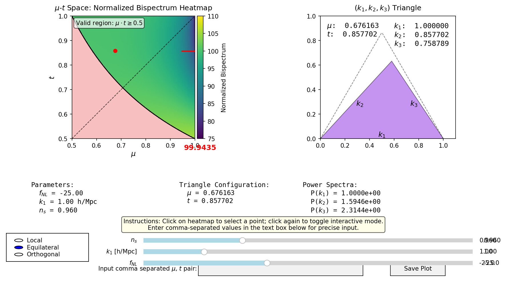
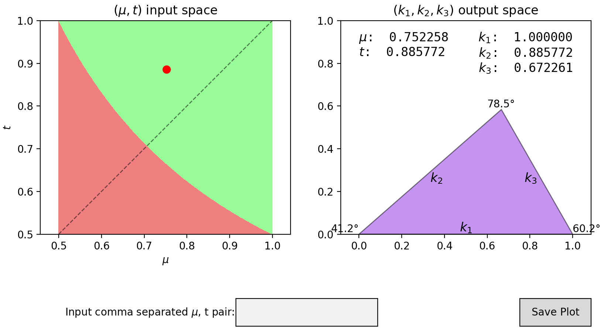

# TriPlot: Bispectrum Visualization tool for Cosmological Analysis

[](https://www.python.org/downloads/)
[](LICENSE)

**TriPlot** is an interactive Python-based visualization framework for analyzing the bispectrum in redshift space, with particular emphasis on primordial non-Gaussianity (PNG) and redshift space distortions (RSD). This tool was developed as part of a Master's thesis project at the Indian Institute of Technology Kharagpur.

## 🔬 Scientific Background

The bispectrum is the Fourier transform of the three-point correlation function and serves as a crucial probe of non-Gaussian features in the cosmic matter distribution. Unlike the power spectrum, the bispectrum is sensitive to phase correlations and can distinguish between different inflationary scenarios through primordial non-Gaussianity signatures.

This framework addresses the complex interplay between:
- **Primordial Non-Gaussianity**: Subtle deviations from Gaussian initial conditions that encode information about early universe physics
- **Redshift Space Distortions**: Anisotropic effects introduced by galaxy peculiar velocities along the line of sight
- **Triangle Configurations**: The geometric dependence of the bispectrum on wavevector triangle shapes and orientations

## ✨ Key Features

### Interactive Visualization Tools
- **Real-time triangle rendering** from parameterized configurations in (μ, t) space
- **Normalized bispectrum heatmaps** across physically allowed triangle domains
- **Orientation-dependent analysis** showing redshift space anisotropies
- **Multi-template support** for different PNG types (local, equilateral, orthogonal)


<!--  -->
---

### Scientific Capabilities
- Systematic exploration of triangle shapes (equilateral, squeezed, flattened, stretched)
- Investigation of scale and orientation dependencies
- Parameter sensitivity analysis for fNL, linear bias, and spectral index
- Interactive parameter adjustment through GUI sliders


### Technical Implementation
- Built with **matplotlib** for interactive plotting and GUI components
- **NumPy** for efficient mathematical operations and array manipulations
- Modular, extensible codebase supporting future enhancements
- Optimized computation of triangle configurations and bispectrum values

## 🛠️ Installation

### Prerequisites
- Python 3.7 or higher
- pip package manager

### Quick Install
```bash
git clone https://github.com/aryabhatta0/TriPlot-BispectrumViz-MTP.git
cd TriPlot-BispectrumViz-MTP
pip install -r requirements.txt
```

## 🚀 Usage

### Basic Triangle Visualization
```bash
python 1_triplot.py
```
Launches the basic triangle configuration explorer with real-time parameter adjustment.

### Normalized Bispectrum Heatmaps
```bash
python 2_bispec_visualizer.py
```
Opens the comprehensive bispectrum analyzer with:
- Interactive heatmap generation
- PNG template switching
- Parameter sensitivity controls
- Exportable visualization outputs

### Specialized Analysis Scripts
```bash
# Scale dependence analysis
cd bispec_dependence/
python scale_dependence.py

# Orientation effects
cd orientation_dependence/
python orientation_analysis.py
```

## 📚 Documentation

Further documentation can be found in the `docs/` directory, including the [thesis report](docs/Thesis_Report_20PH20005.pdf) and [presentation](docs/Thesis_Presentation_20PH20005.pdf).


### References
- [Bharadwaj et al. (2020)](https://arxiv.org/abs/2001.10243): Parameterizing RedShift Distortions
- [Scoccimarro (2012)](https://arxiv.org/abs/1108.5512): Primordial Non-Gaussianity and the Bispectrum
- [Forero-Romero, J. E. et al. (2009)](https://arxiv.org/abs/0809.4135): Dynamical Classification of the Cosmic Web
- [Mazumdar et al. (2020)](https://arxiv.org/abs/2005.07066): Second-order Perturbation Theory in Redshift Space

## 🤝 Contributing

Contributions are welcome! Please feel free to submit issues, feature requests, or pull requests. For major changes, please open an issue first to discuss the proposed modifications.

## 📜 Citation

If you use this toolkit in your work, please cite:

```
Aryabhatta Aryan (2025). TriPlot: Visualization tools for thesis project. 
IIT Kharagpur Master's Thesis. https://github.com/aryabhatta0/TriPlot-BispectrumViz-MTP
```

## 📄 License

This project is licensed under the MIT License - see the [LICENSE](LICENSE.md) file for details.

## 🙏 Acknowledgments

- Prof. Somnath Bharadwaj for supervision and guidance
- Department of Physics, IIT Kharagpur

---

*This project was developed as part of the Master Thesis Project at IIT Kharagpur during the 2024–25 academic session.*